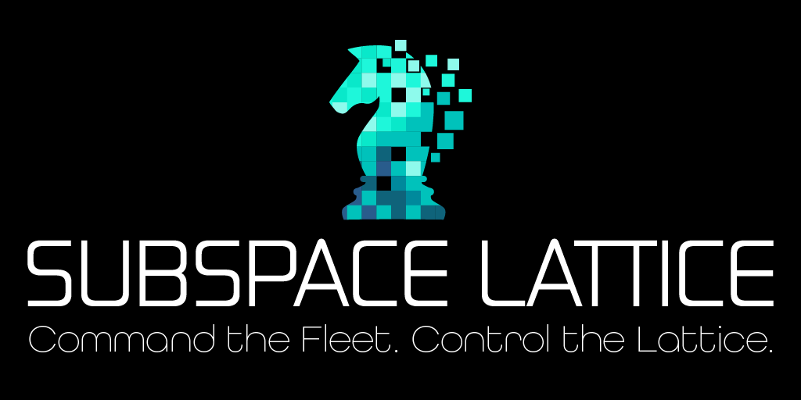

# Subspace Lattice

<div align="center">
  
</div>

Nx monorepo for the Subspace Lattice board game — **Firebase Auth**, **Firestore**, **Cloud Functions**, with optional **Tauri** desktop shell.

## Projects

| Nx name | Package | Path | Role |
|---------|---------|------|------|
| `core` | `@subspace-lattice/core` | `packages/subspace-lattice` | Game engine + types |
| `react-ui` | `@subspace-lattice/react` | `packages/subspace-lattice-react` | Board/Lobby/Chat + Firebase client |
| `functions` | `@subspace-lattice/functions` | `apps/functions` | Authoritative callables |
| `web` | `@subspace-lattice/web` | `apps/web` | Vite browser host |
| `desktop` | `@subspace-lattice/desktop` | `apps/desktop` | Tauri 2 shell over `web` |

## Prerequisites

- Node 22+, Yarn 4 (Corepack)
- Firebase CLI (`firebase-tools` in this repo)
- Rust toolchain (for desktop): https://rustup.rs
- Firebase project: **[subspace-lattice](https://console.firebase.google.com/u/0/project/subspace-lattice/overview)**

## One-time Firebase setup

1. Enable **Authentication** → Anonymous + Google  
2. Create a **Firestore** database  
3. Register a Web app; copy config into `apps/web/.env` (see `.env.example`)  
4. `yarn firebase use subspace-lattice`

## Local development

```bash
yarn install

# Terminal A
yarn emulators

# Terminal B — browser
yarn serve:web

# Or desktop (starts web vite via Tauri beforeDevCommand)
yarn serve:desktop
```

## Commands

```bash
yarn nx run-many -t lint test build typecheck
yarn nx test core
yarn nx test functions          # room-logic (+ rules tests when emulator is up)
yarn test:rules                 # firestore rules via emulator
yarn test:e2e                   # Playwright (local AI path)
yarn nx build core
yarn nx build react-ui
yarn nx build functions
yarn nx build web
yarn nx run desktop:tauri-build
```

## Environment helpers

```bash
# shellcheck source=scripts/lib/subspace-env.sh
. scripts/lib/subspace-env.sh
subspace_env_load web      # or: base | desktop | functions | deploy | e2e
subspace_env_validate web
```

See [`.env.example`](.env.example) and [`apps/web/.env.example`](apps/web/.env.example).

## Firestore model

- `roomCodes/{code}` → `{ roomId }`
- `rooms/{roomId}` — seats / members (Functions write only)
- `rooms/{roomId}/meta/gameState`
- `rooms/{roomId}/chat/{messageId}`
- `rooms/{roomId}/events/{eventId}`
